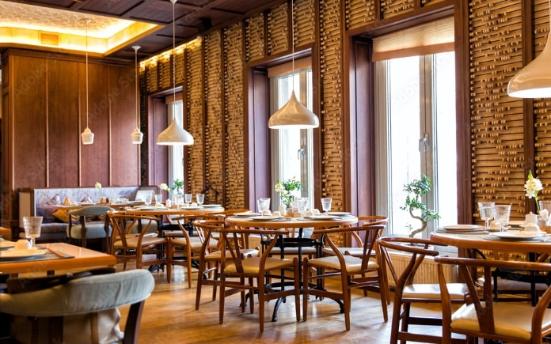

# Delicious Restaurant

Welcome to **Delicious Restaurant**, where we serve flavorful dishes for every taste! Our website is built using modern web technologies to provide a seamless and delightful user experience.

## Features


### Hero Section
- A visually appealing hero section with a background image and animated text using `react-type-animation`.
- Quick access buttons for **Contact Us** and **Explore Menu** with icons from `react-icons`.

### Navbar
- A responsive navigation bar with links to key sections like Home, About, Menu, Reservations, and more.
- Mobile-friendly menu toggle using `react-icons` for a clean and intuitive design.

## Technologies Used
- **React**: For building reusable UI components.
- **Next.js**: For server-side rendering and optimized performance.
- **Tailwind CSS**: For styling and responsive design.
- **React Icons**: For adding beautiful icons to the UI.

## Installation

1. Clone the repository:
    ```bash
    git clone https://github.com/mubashir1837/Little-Lemon-Webiste.git
    ```
2. Navigate to the project directory:
    ```bash
    cd lemon-app
    ```
3. Install dependencies:
    ```bash
    npm install
    ```
4. Run the development server:
    ```bash
    npm run dev
    ```

## Usage

- Visit the homepage to explore the hero section and navigation bar.
- Use the menu links to navigate to different sections of the website.

Mubashir Ali - Founder @ Code with Bismillah | Aspiring Bioinformatics & Data Science Professional | Bridging Biology & Data | Researcher | Genomics, Machine Learning, AI | Python, R, Bioinformatics Tools

## Contributing

We welcome contributions! Please fork the repository and submit a pull request with your changes.

## License

This project is licensed under the [MIT License](LICENSE).

---

Enjoy your experience at **Delicious Restaurant**! 🍴
